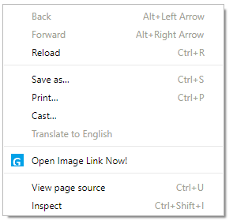

# Google Full Image Opener

A desktop web browser extension to bring the original image link opening back on new Google Images website.

# Install

  - Google Chrome or Chromium ([WebStore](https://chrome.google.com/webstore/detail/beojccknfoajfebcpijalgejjpbdipcb))

# How to use

After clicking an image from search results, use the context menu (right-click) to view the current image in a new tab.

# License

GPLv2 ([GNU Public License - 2.0](https://www.gnu.org/licenses/old-licenses/gpl-2.0.en.html))